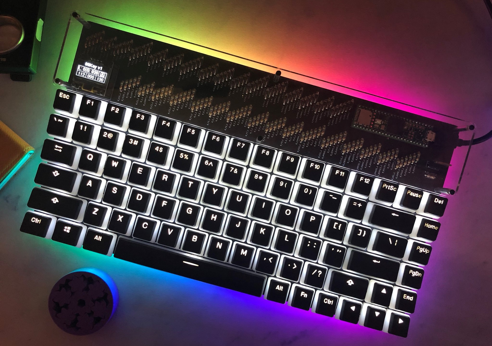
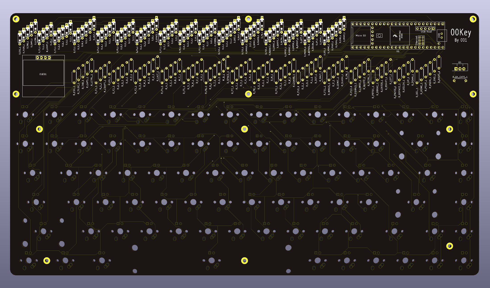
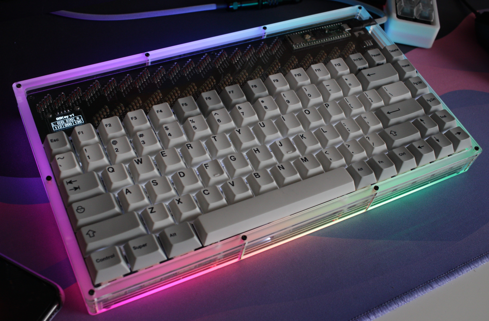

# 001Key

Custom 75% Keyboard.

## Hardware

- Teensy 4.1 development board
- SSD1306 0.96 Inch OLED Display
- MX & Alps switch support
- Backlight (single color) support
- RGB Underglow support

## Firmware

Custom firmware, has layer, OLED, Backlight, Underglow support

## OLED display

Displays currently shows

- capslock status
- Selected layer
- backlight intensity 
- Underglow collor selection (RGB Values)

## Underglow

3 Effects
- Solid color
- Rotating rainbow
- Off

## PCB

- Designed in kicad
- Used freerouting for traces

## Backplate

- Designed in FreeCAD
- Spaced from PCB with (10mm) standoffs
- STL files included for 3D printing in 2 parts

## Case

Stacked acrylic case

