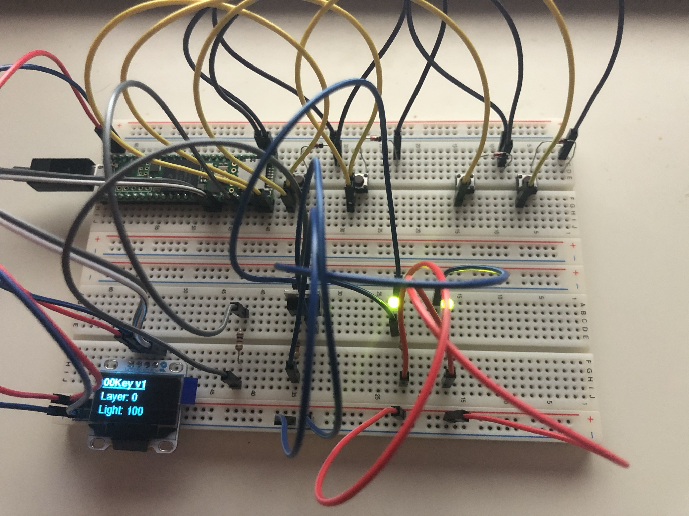

# 001Key

Custom 75% Keyboard.

## Hardware

- Teensy 4.1 development board
- Velleman 0.96" OLED-display (I2C, SSD1306)
- Switches TBD
- LEDS TBD

## Firmware

Custom firmware, has OLED, backlight and layer support.

Currently  no key debounce programmed in yet.

This is my first c++ project, im used to C# development, so all this stuff about header files and pointers are kinda new to me, expect some weird programming choices.

On that note; feel free to open an issue or a pull request if you think something is wrong. 😉

## OLED display

Displays current layer, backlight intensity and capslock status.

## Prototype

- 2 x 2 key matrix
- 2 backlight LED
- OLED display

## TODO

- PCB design
- Switch and LED selection