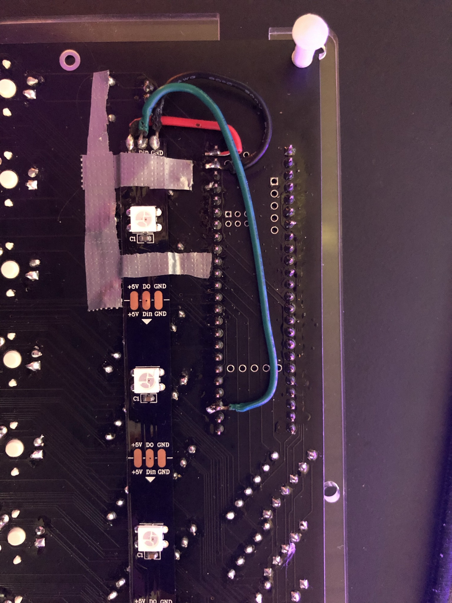

## underglow

A 16 (2x8) led ws2812b rgb strip can be attached to the bottom of the pcb to provide underglow.

Should be soldered to the teensy underside like this: 

black = ground
red = 5v
green = data

In the default keymap the underglow effect can be toggled between static, rainbow, and off with Fn+U

The static effect can be changed using the Fn key in combination with the keys left (value down) and right (value up) of the R, G, and B keys. For example pressing Fn+E will make the Red value go down while pressing Fn+T will make the Red value go up.

## underglow spacer

This can be 3d printed to put over the standoffs between the pcb and the bottom plate 
(not when using the acrylic case).

Provides a convenient place to stick the rgb strips.
